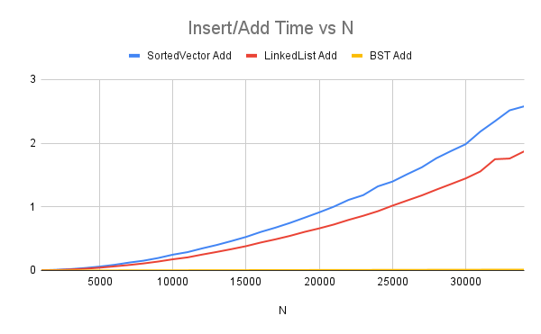
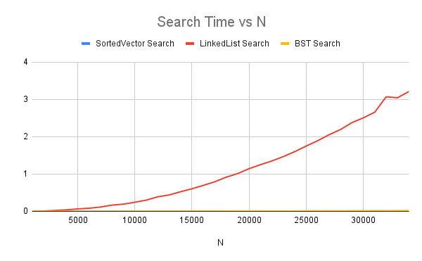
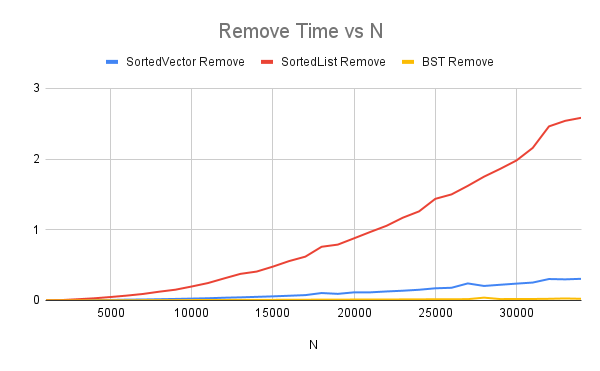

# Report for Data Structure Speed Comparison Homework

Make sure to answer every question in this homework. You should not bullet point your answers, but
instead write them as a full report format. This doesn't mean you have to be wordy, as concise is good,
but it does mean you need to use proper grammar, spelling, and be complete. For question that just
ask for a short answer, answer accordingly. Make sure to include references where appropriate.

## Algorithmic Analysis - Big $O$

Complete the Big O table below for the following functions. You may use any resource you like, but
for the SortedVector and SortedList, you should use the Big O for the functions you wrote in the
the homework. Both Single and Double Linked List you can assume head and tail pointers are available. 
Don't forget to use latex math notation (example in the table).

### Big $O$ Table


| -                         | Add/Insert |   Remove   | Search/Find |    Sort    | Add Front | Add Back | Remove Front | Remove Back | Get by Index |
| ------------------------- | :--------: | :--------: | :---------: | :--------: | :-------: | :------: | :----------: | :---------: | :----------: |
| Vector                    |    O(n)    |    O(n)    |     O(n)    | O(n log n) |    O(n)   |   O(1)*  |     O(n)     |     O(1)    |     O(1)     |
| Single Linked List        |    O(n)    |    O(n)    |     O(n)    | O(n log n) |    O(1)   |   O(1)   |     O(1)     |     O(n)    |     O(n)     |
| Double Linked List        |    O(n)    |    O(n)    |     O(n)    | O(n log n) |    O(1)   |   O(1)   |     O(1)     |     O(1)    |     O(n)     |
| Sorted Vector             |    O(n)    |    O(n)    |   O(log n)  |    O(1)    |    ---    |    ---   |      ---     |     ---     |      ---     |
| Sorted Single Linked List |    O(n)    |    O(n)    |     O(n)    |    O(1)    |    ---    |    ---   |      ---     |     ---     |      ---     |
| Sorted Double Linked List |    O(n)    |    O(n)    |     O(n)    |    O(1)    |    ---    |    ---   |      ---     |     ---     |      ---     |
| Binary Search Tree        | O(log n)** | O(log n)** |  O(log n)** |    O(n)    |    ---    |    ---   |      ---     |     ---     |      ---     |


For Sort, we are asking for the Big $O$ for taking the current data structure and writing it 'sorted' to a file. However, not the file writes. For example, if you have a vector of 1000 elements, and you want to write it to a file, you would need to sort it first. So, the Big $O$ for this would be the Big $O$ for sorting. For BST, you have to convert the tree to a sequential structure, so the cost of doing that.  

### Assumptions with Sort

Since the worst case can change considerably based on what sort you use for sorting (if any), list each algorithm below, and specify the algorithm used in your assumption.  For BST, write which  method of traversal you would use to sort it.  

* Vector: Merge sort because the random access allows O(1) indexing
* Single Linked List: Linked list merge sort because its most efficient splitting using slow/fast pointers
* Double Linked List: Linked list merge sort because random access is till O(n)
* Sorted Vector - already sorted: Merge sort best case scenario is still O(n log n) since it always splits
* Sorted Single Linked List - already sorted: Merge sort because the best case is still O(n log n) since it always splits recursively
* Sorted Double Linked List - already sorted: Merge sort since best case is still O(n log n) regardless if the order
* Binary Search Tree: In order DFS because in any bst, an in order traversal outpur keys in a sorted order anyways.

### Worst Case vs. Average Case

There are a few functions whose worse case is very different than the average case. Name at least two of them, and explain why the worse case is so much worse than the average case. 

1. When searching in an unsorted linked list.Average case would be finding the item in the middle somwhere.Worst case is the item you are looking for is at the very end or not in there at all making you check every node which is time consuming.
2. Binary search tree. Avergae case is a balanced bst letting you search in half each step.Worst case would be a very unbalances BST and you have to check every node.

## Empirical Analysis - Speed Comparison

For this section, you will need to have run the speed compare program and generated the output into a CSV file.

### Empirical Results Table

[CSV result file](./results_100k.csv)

### Analysis

Create *at least three* graphics that each visually explain an aspect of your data related to an operation or data structure. Under each one, explain what the graphic is showing, and what you can conclude from it/what you find interesting about it.

> [!IMPORTANT]
> 
> Make sure you are comparing apples to apples and not apples to oranges when choosing what to put in the same graph. 
> 
> **:x: different data structures *and* different operations**
> 
> - Vector Add Front versus BST Add
> 
> **:white_check_mark: different operations *but* same data structure**
> 
> - BST Add versus Remove, and Search for BST
> 
> **:white_check_mark: different data structures *but* same operation**
> 
> - BST Add versus Add for Sorted Vector, and Sorted Single/Double Linked List
> 
> - Vector Add Front versus Add Front for Single/Double Linked List

> [!TIP]
> 
> To create the graphics you can use a third party program like Microsoft Excel or Google Sheets. (Completely optional if you want extra coding: you can use python libraries such as matplotlib, seaborn, or plotly)
> 
> Make sure you can see the image embedded in the Report.md using [image markdown] when you upload it to github, and get help if it doesn't show! 

#### Graphic 1 Insert/Add Time verse N



> This graphic shows how long each data structure takes to insert N elements. The BST consistently inserts much faster than both SortedVector and SortedList because it only requires O(log n) positioning, while SortedVector requires shifting elements O(n), and SortedList requires walking the list to find position O(n).

#### Graphic 2 Search Times verse N



> This graphic compares how long each data structure takes to search for an element. SortedVector performs binary search, giving very low search times. LinkedList is slow because it must check nodes one-by-one O(n). BST search follows the tree structure and stays near O(log n)making it extremely fast if the tree is balanced. BST and SortedVector dominate in search speed. LinkedList search is always slow and increases steadily with N because it must scan in order.

#### Graphic 3 Remove Time vs N



> This graph shows the cost of removing elements from each structure. Removing from a BST is more efficient than removing from a sorted vector (which requires shifting elements). Sorted linked list is O(n) too because it needs to find the node first. Removing in BST grows much more slowly than SortedVector and SortedList. BST consistently performs better for large N due to its logarithmic structure.

## Critical Thought

### Data Evaluation

Answer the questions below. Make sure to answer each question fully, and explain your reasoning. Indent your answers immediately below the question, for it to line up with the bullet point.

For example:

```markdown
1. What is the most surprising result from the data? Why is it surprising?
   Answer here
```

1. What is the most surprising result from the data? Why is it surprising?
   The most surprising result from the data is how fast the BST performed compared to the sorted vector and sorted linked list, especially as N got larger. I expected the BST to be faster, but I didn’t expect the difference to become so dramatic. It was surprising to see how quickly the other structures slowed down, while the BST stayed efficient. 

2. What data structure is the fast at adding elements (sorted)? Why do you think that is?
   From the data, the BST is the fastest structure for adding elements in sorted order. This makes sense because the BST doesn’t need to shift elements like a sorted vector or scan through each node like a sorted linked list. Instead, it follows its tree structure and finds the correct spot in about log(n) steps. This makes inserting quicker, especially as the data grows.

3. What data structure is the fastest at removing elements (sorted)? Why do you think that is?
   The BST is the fastest at removing elements in sorted order. This is likely because it only needs to go through the tree to find the node and then adjust a few pointers, which is much faster than a sorted vector or a sorted linked list. The BST’s structure keeps removing much more efficient even as the data grows.

4. What data structure is the fastest at searching? Why do you think that is?
   The sorted vector is the fastest at searching because it can use binary search. This lets it jump around the data and cut the search space in half each step, instead of checking every item one by one. 

5. What data structure is the fastest for adding elements to the front? Why do you think that is?
   The linked list is the fastest for adding elements to the front. This is because adding to the front only requires changing one pointer to the new node just becomes the new head. 

6. What data structure is the fastest for adding elements to the back? Why do you think that is?
   The vector is the fastest for adding elements to the back because it only needs to place the new element at the end. Vectors keep extra capacity so it feels almost instant making it more efficient. For that reason, even though Linked lists are fast, vector works best.

7. What data structure is the fastest for removing elements from the front? Why do you think that is?
   The linked list is the fastest for removing elements from the front. This is because the head node can be removed just by moving the head pointer to the next node. No shifting or rearranging is required. 

8. What data structure is the fastest for removing elements from the back? Why do you think that is?
   The vector is the fastest for removing elements from the back, it easily drop the last element without shifting anything else. A linked list is slower since it goes through the nodes to find the one right.

### Deeper Thinking

#### Double Linked List vs Single Linked List

1. If you wrote your linked list as a single linked list, removing from the back was expensive. If you wrote it as a double linked list, removing from the back was cheap. Why do you think that is?
   In a singly linked list, removing from the back is slow because you have to start at the head and walk through every node just to find the one right before the tail. But in a doubly linked list, each node has a pointer to both the next and previous node, so you can jump straight to the tail’s previous node without looking through the entire list. This makes removing from the back much faster.

2. When running most functions, at least ~30% of the tests were worse case scenarios. Why do you think that is? 
   A lot of the tests ended up being worst case scenarios because the data was added in sorted order.  For example, sorted data makes the sorted vector shift a ton of elements, and they make the BST grow into a long chain. 

3. What was done in the code to encourage that? 
   In the code, the tests were set up in a way that was intentionally making slower paths of each data structure. I noticed this in the movies,they were added in sorted order, The code also ran not typical operations like removing from the front of a vector or searching for elements near the end or not even there. By being intentional in these ways, the program made sure the tests geared toward more worst case scenarios.

4. How did this particularly influence the linked list searches?
   Because the data was added in sorted order, the linked list can only look at one node at a time, so when the program searched for elements near the end or ones that didn’t exist t had to walk through almost the entire list which made it slow. This made the searches into worst case scenarios.

#### Test Bias

1. The tests were inherently biased towards the BST to perform better due the setup of the experiment. Explain why this is the case.  (hint: think about the randomization of the data, and the worst case scenario for BST).
   The tests were biased toward the BST because the data was randomized, which helps keep a BST balanced. If a BST is balanced its much fsater for inserts, searches, and removing.

2. What would generate the worst case scenery for a BST?
   The worst case scenario for a BST is when the data is already sorted, because it turns the tree into a long linked list and makes everything slow.

3. Researching beyond the module, how would one fix a BST so the worst case scenario matches (or at least i closer to) the average case.[^1^]
   One could use a 'self balancing tree.' These are special kinds of BST that automatically rotate and rebalance themselves when a noew is inserted or removed.

## Scenario

Fill out the table below. This is a common technical interview topic!


| Structure              | Good to use when                                                                        | Bad to use when                                                                  |
| ---------------------- | --------------------------------------------------------------------------------------- | -------------------------------------------------------------------------------- |
| Vector            | When you need fast indexing and quick access by position.                            | When you constantly add or remove from the front or middle.                      |
| Linked List        | Good for stacks or queues with frequent front-only access.                              | When you need fast search or random access.                                      |
| Sorted Vector      | When values coming in are already mostly sorted and we need quick search access.        | When space is limited and the dataset is extremely large causing memory to swap. |
| Sorted Linked List | When you need to maintain sorted order but memory is tight and insertions are frequent. | When you need fast search or fast random access.                                 |
| BST                | When data comes in random order so the tree stays balanced naturally.                   | When data is presorted, making the BST behave like a slow linked list.           |


## Conclusion

Summarize your findings. Where there any surprises?  What did you end up learning by comparing speeds?
   After comparing the speeds of all the data structures, the biggest thing I learned is how much the structure and layout of data affects the performance. The BST consistently performed the best overall(especially for inserting, searching, and removing) which makes sense because it stays close to log(n). The sorted vector was surprisingly fast at searching, and the linked list was great for only front operations.

   The biggest surprise was how dramatic the differences became as N grew. Especially how quickly the sorted vector slowed down on inserts and removes, and how badly the linked list performed when searching. Seeing the actual timing made Big O behavior in the data structures helped me understand why choosing the right data structure really matters.

## Technical Interview Practice Questions

For both these questions, are you are free to use what you did as the last section on the team activities/answered as a group, or you can use a different question.

1. Select one technical interview question (this module or previous) from the [technical interview list](https://github.com/CS5008-khoury/Resources/blob/main/TechInterviewQuestions.md) below and answer it in a few sentences. You can use any resource you like to answer the question.

2. Select one coding question (this module or previous) from the [coding practice repository](https://github.com/CS5008-khoury/Resources/blob/main/LeetCodePractice.md) and include a c file with that code with your submission. Make sure to add comments on what you learned, and if you compared your solution with others. 

## References

Add your references here. A good reference includes an inline citation, such as [1] , and then down in your references section, you include the full details of the reference. Computer Science research often uses [IEEE] or [ACM Reference format].

[1] Reference info, date, etc.

[^1^]: Implementing a BST with a self-balancing algorithm, such as AVL or Red-Black Trees is a great research paper topic!

<!-- links moved to bottom for easier reading in plain text (btw, this a comment that doesn't show in the webpage generated-->

[image markdown]: https://docs.github.com/en/get-started/writing-on-github/getting-started-with-writing-and-formatting-on-github/basic-writing-and-formatting-syntax#images

[ACM Reference Format]: https://www.acm.org/publications/authors/reference-formatting
[IEEE]: https://www.ieee.org/content/dam/ieee-org/ieee/web/org/conferences/style_references_manual.pdf

- Knuth, D. 1997. The Art of Computer Programming. Addison-Wesley. Retrieved from https://www-cs-faculty.stanford.edu/~knuth/taocp.html
- Cormen, T., Leiserson, C., Rivest, R., and Stein, C. 2009. Introduction to Algorithms. MIT. Retrieved from https://mitpress.mit.edu/books/introduction-algorithms-third-edition
- GeeksforGeeks. 2024. Data Structures and Algorithms. Retrieved from https://www.geeksforgeeks.org/data-structures/
- W3Schools. 2024. C Programming Language Tutorial. Retrieved from https://www.w3schools.com/c/
- Stack Overflow. 2024. Top Questions on C Programming. Retrieved from https://stackoverflow.com/questions/tagged/c
- Khan Academy. 2024. Algorithms Course. Retrieved from https://www.khanacademy.org/computing/computer-science/algorithms
- TutorialsPoint. 2024. C Data Structures Tutorial. Retrieved from https://www.tutorialspoint.com/data_structures_algorithms/index.htm